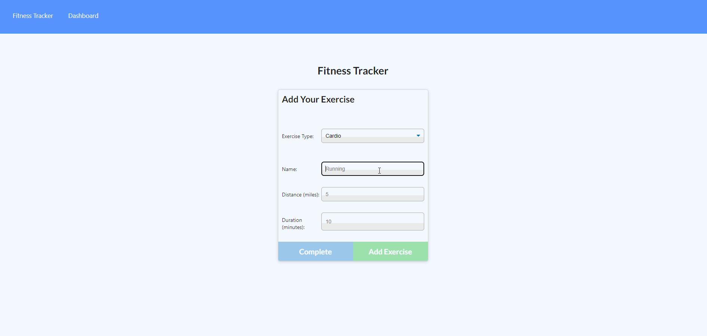

# 10-1-hw-fitness-tracker

## Description

This full stack application allows users to add exercises into a daily workout and then view workouts in a visual display of two grpahs.

## Deployment

The application is deployed [here](https://hw-10-1-workout-tracker.herokuapp.com/).

## Packages Used

-   [express](https://www.npmjs.com/package/express)
-   [mongoose](https://www.npmjs.com/package/mongoose)

## Demonstration
